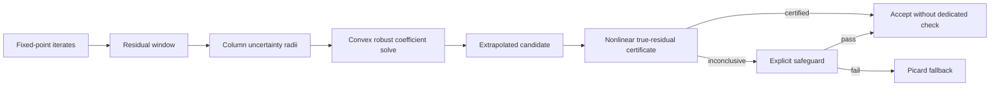

<div align="center">

# RRPE

### Uncertainty-Calibrated Residual Polynomial Extrapolation

**Robust residual-polynomial acceleration for inexact fixed-point iterations.**

<p>
  
  
  
  
</p>

</div>

---

> [!IMPORTANT]
> RRPE is not "RRE with a coefficient cap." The coefficient penalty is the exact robust counterpart of residual extrapolation when the residual window is uncertain.

## TL;DR

Classical RRE, MPE, and Anderson acceleration minimize a predicted residual over a small affine window. When the window is nearly rank deficient, the predicted residual can become tiny only by using large positive and negative coefficients. In exact arithmetic this is polynomial cancellation. In inexact computation it is uncertainty amplification.

RRPE replaces the clean residual window by an uncertainty-calibrated one:

```math
\widetilde R_k = R_k + E_k,
\qquad
\|E_{k,:j}\|_2 \le \widehat\delta_{k,j},
```

and solves the robust convex extrapolation problem

```math
\widehat\alpha_k \in
\arg\min_{\mathbf 1^\top\alpha=1}
\left\{
\|\widetilde R_k\alpha\|_2
+
\sum_j \widehat\delta_{k,j}|\alpha_j|
\right\}.
```

The method then certifies the nonlinear candidate instead of blindly trusting the predicted residual.

## One-Line Mechanism

```math
\boxed{
\text{acceleration gain}
\quad + \quad
\text{certified uncertainty amplification}
}
```

RRPE turns coefficient size from a tuning knob into a measurable robustness cost.

## Method Pipeline



## Mathematical Core

Given a fixed-point map

```math
G:\mathbb R^n\to\mathbb R^n,
\qquad
F(x)=G(x)-x,
```

and a residual window

```math
X_k=[x_{i_1},\ldots,x_{i_p}],
\qquad
R_k=[F(x_{i_1}),\ldots,F(x_{i_p})],
```

classical residual extrapolation uses

```math
\min_{\mathbf 1^\top\alpha=1}\|R_k\alpha\|_2,
\qquad
z_k=X_k\alpha.
```

RRPE models the observed window as uncertain and uses the exact robust counterpart

```math
\max_{\|E_{:j}\|_2\le \delta_j}
\|(R+E)\alpha\|_2
=
\|R\alpha\|_2+
\sum_j\delta_j|\alpha_j|.
```

That identity is the reason the weighted one-norm appears. It is not a cosmetic regularizer; it is the worst-case residual-window error induced by the coefficient vector.

## What This Repository Contains

| Component | Role |
|---|---|
| `docs/algo.tex` | Full manuscript source. |
| `docs/algo.bib` | BibTeX database with the numerical-analysis and robust-optimization literature. |
| `src/rrpe_experiments.py` | Dependency-free experiment driver. |
| `src/rrpe_experiment_output.txt` | Captured output from the final experiment driver. |
| `docs/rrpe_experiments.py` | Reproducibility copy used beside the manuscript. |
| `docs/rrpe_experiment_output.txt` | Captured manuscript table output. |

## Theory Stack

| Layer | Main object | Guarantee |
|---|---|---|
| Robust residual model | `R + E` with columnwise radii | Exact minimax counterpart. |
| Statistical calibration | `delta_hat_{k,j}` | Window and iteration-level coverage. |
| Convex coefficient solve | Nonsmooth SOCP-equivalent objective | Oracle inequality. |
| Nonlinear certification | Candidate-dependent defect `D_k(alpha)` | True-residual upper bound. |
| Selective safeguard | Lower confidence bound `L_k` | Certified acceptance without dedicated check. |
| Spectral pathology | Close-spectrum affine family | `||alpha_h^rre||_1 = Theta(h^{-(p-1)})`. |
| Inexact recurrence | Weighted evaluation errors | Noise floor tracks `sum_j |alpha_j| epsilon_j`. |

## Experiments at a Glance

| Block | What it tests | Why it matters |
|---|---|---|
| `CoverageGaussian` | Exact Gaussian column oracle | Sanity check for confidence radii. |
| `CoveragePinelis` | Distribution-free bounded-vector radius | Connects concentration theory to experiments. |
| `Phase` | Robust path as uncertainty increases | Shows the RRE-to-conservative transition. |
| `Scaling` | Close-spectrum coefficient blow-up | Verifies the asymptotic rate. |
| `BratuBenchmark` | Nonlinear certified fixed-point solve | Compares Picard, RRE, ridge-RRE, Anderson, simplex-RRE, RRPE. |
| `LargeInexact` | Inexact PDE-like fixed-point solve | Uses inner CG residuals as real uncertainty radii. |
| `Noise` | Stochastic residual perturbations | Measures the predicted residual floor. |
| `Ablation` | Scalar vs columnwise vs simplex vs ridge | Identifies which robustness mechanism is active. |

## Quickstart

The experiment driver uses only the Python standard library.

```bash
cd /home/nckh2/qa/Algo
python3 src/rrpe_experiments.py | tee src/rrpe_experiment_output.txt
```

Expected output sections:

```text
CoverageGaussian
CoveragePinelis
Phase
Scaling
ScalingSlope
BratuBenchmark
LargeInexact
Noise
Ablation
SolverSummary
```

## Solver Notes

The final RRPE coefficient solver uses active-set enumeration over support and sign patterns for the small-memory nonsmooth convex problem. Each solve records:

- affine feasibility,
- robust objective value,
- KKT/stationarity diagnostic,
- comparison sanity gap against feasible baselines such as RRE, ridge-RRE, or simplex-RRE.

This is deliberate: the reported RRPE coefficient must be globally competitive with every feasible comparison vector used in the experiment.

## Manuscript Structure

```text
1. Introduction
2. Related Work and Positioning
3. Methodology and Theory
4. Numerical Validation
5. Conclusion
```

## Citation Stub

```bibtex
@misc{rrpe2026,
  title = {Uncertainty-Calibrated Residual Polynomial Extrapolation for Inexact Fixed-Point Iterations},
  year  = {2026},
  note  = {Manuscript}
}
```

---

<div align="center">

**RRPE: residual extrapolation when the residual window itself is data.**

</div>
